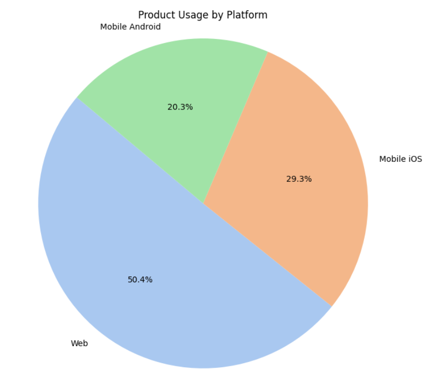
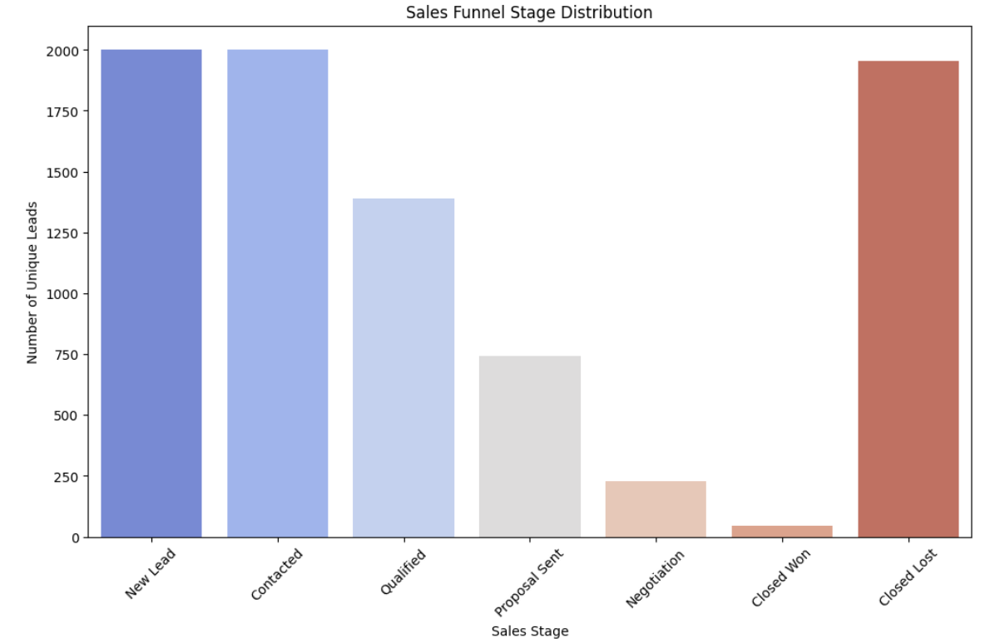

#  SaaS 数据分析项目案例：产品使用、销售漏斗与客户反馈洞察

🟣 本项目模拟一个 B2B SaaS 产品的真实运营场景，系统性展示如何通过数据分析支持 产品优化、销售策略调整和市场决策制定。从数据生成到可视化呈现，涵盖产品使用行为、销售转化路径、客户反馈和营销渠道表现等多个维度。

🟣 本项目旨在展示我独立完成从数据构建、清洗、分析到可视化呈现的能力，尤其是在构建富有洞察力的分析报告方面，帮助业务理解用户行为、优化漏斗表现、评估渠道效率并挖掘潜在市场机会。

## 🟣 项目结构

```
product-insight-case/
├── product_usage.py                  
├── charts/                           
│   ├── top5_feature_usage.png
│   ├── platform_usage.png
│   ├── sales_funnel_stage_distribution.png
│   ├── win_rate_by_lead_source.png
│   ├── total_conversions_by_marketing_channel.png
│   ├── average_cost_per_conversion.png
│   └── ...（其他图表）
├── README.md                         
```

## 🟣 项目背景与目标

🎯 项目背景：
我构建了一个虚拟的 SaaS 企业数据环境，模拟并分析以下典型业务数据：

- 用户产品使用日志（功能点击、平台偏好、使用时长）
- 营销线索转化数据（典型销售漏斗模型）
- 客户反馈文本数据（模拟打分、情绪分析）
- 市场趋势指标（行业增长、竞争活跃度、均价波动）
- 多渠道营销活动成效数据（点击、转化、成本）
🎯 项目目标：通过数据分析还原真实业务逻辑，挖掘用户行为与业务指标间的关联，助力产品和市场决策。

## 🟣 分析模块

### 1. 产品功能使用分析

1.1 分析内容：

- 最受欢迎的产品功能
- Web/iOS/Android 各平台使用偏好
- 用户平均使用时长趋势

1.2 图示：

  


1.3 业务洞察价值：

- 揭示核心功能价值与使用粘性
- 指导产品资源投入与平台优化方向

### 2. 销售转化漏斗分析

2.1 分析内容：

- 销售线索在各阶段的数量分布
- 每个阶段的转化率计算
- 不同渠道带来的赢单率对比

2.2 图示：

  


2.3 业务洞察价值：

- 识别转化瓶颈，优化销售策略
- 优化营销渠道预算分配

### 3. 营销活动效果分析

3.1 分析内容：

- 按渠道/类型统计转化总量
- 平均转化成本（CPL）对比
- 点击率与成本效率评估

3.2 图示：

  


3.3 业务洞察价值：
- 衡量营销 ROI，精细化投放预算
- 提炼高效渠道组合策略
---

### 4. 客户反馈分析

4.1 分析内容：

- 反馈类型分布（NPS、Review、社媒评论等）
- 各类反馈的情感倾向与打分分布
- 高频关键词和负面情绪词云分析（可拓展）

4.2 图示：


4.3 业务洞察价值：

- 理解用户痛点与情绪波动
- 为产品迭代提供定性输入
---

## 🟣 技术栈与工具

- 语言与框架：**Python**（Pandas, Numpy, Random, datetime）
- 数据可视化：**Matplotlib, Seaborn, WordCloud**
- NLP 处理（可选扩展）：**TextBlob, Jieba**
- 开发环境：Jupyter Notebook
- 版本管理：Git + GitHub

## 🟣 项目亮点

✅ 从 0 到 1 模拟数据生成、数据建模、分析与可视化全流程
✅ 贴合商业分析常见主题：产品行为、销售转化、营销评估、客户反馈
✅ 图表直观、结构清晰，适合在作品集中展示
✅ 可扩展性强：支持替换为实际业务数据用于复用或定制化报告输出

##  🟣 项目地址

👉 GitHub 仓库：[glowye/product-insight-case](https://github.com/glowye/product-insight-case)

---

